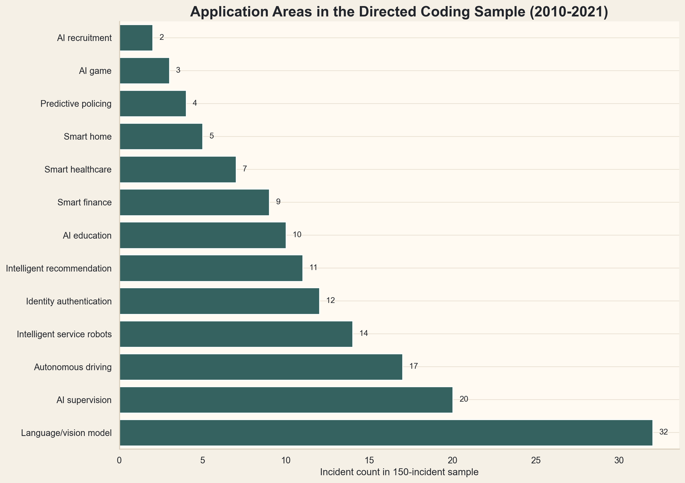
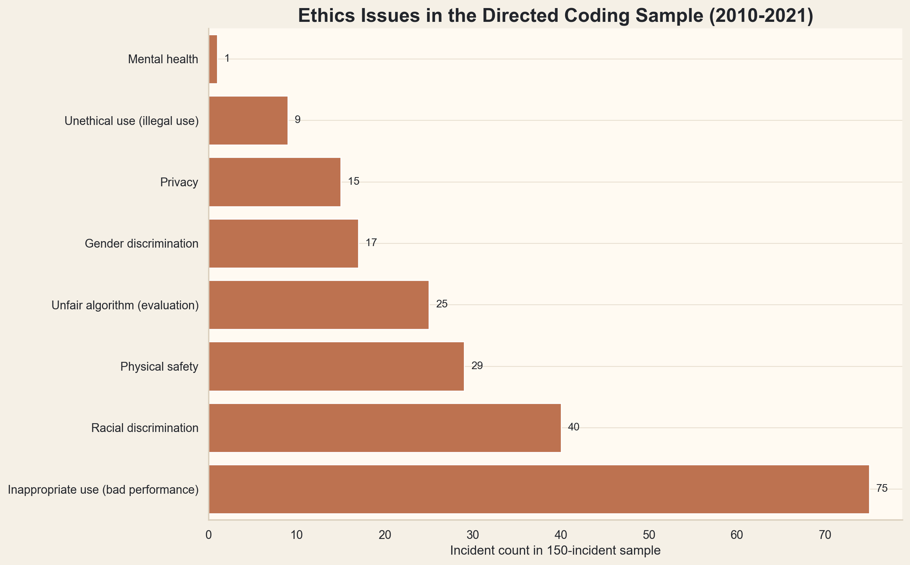
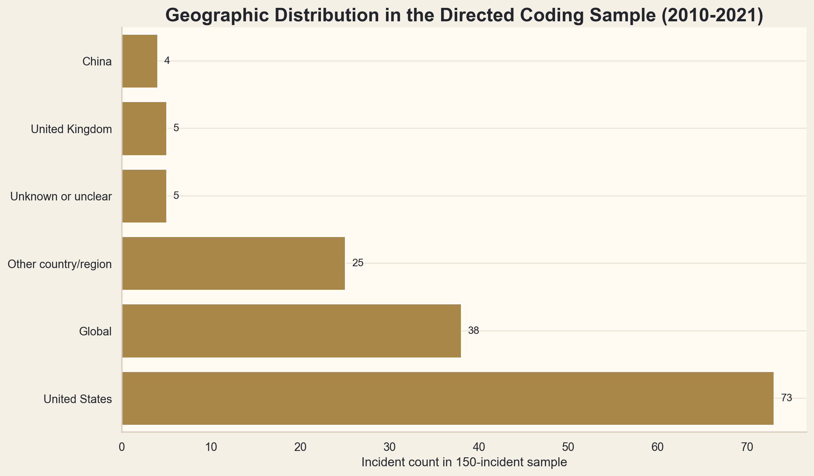
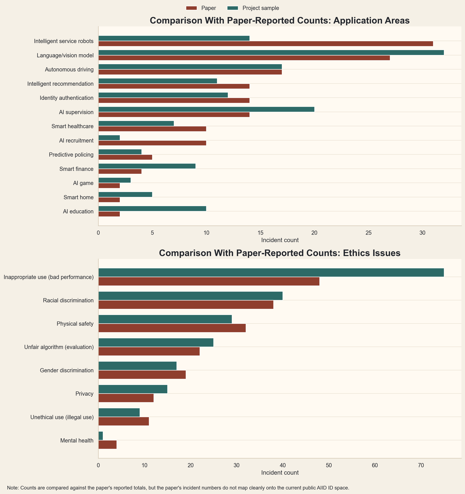
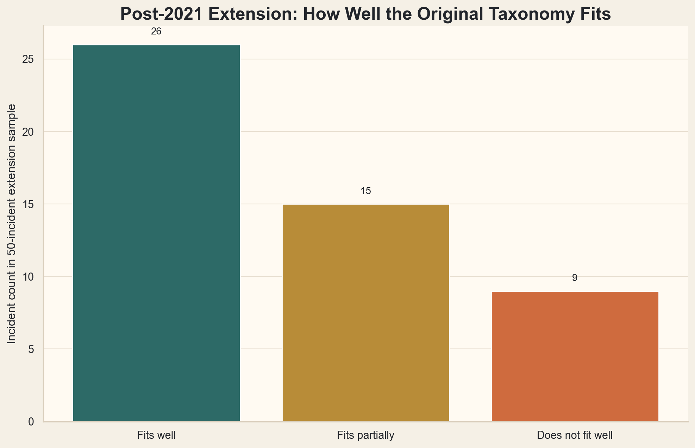

# What Actually Goes Wrong With AI?

_A simple reproduction and update of an AI incident database study_

## What this project is
This project recreates the coding structure of an AI incident study using a reproducible 2010-2021 sample from the AI Incident Database. The original paper used manual qualitative content analysis; this project uses LLM-assisted directed coding to apply the paper's published categories, with final labels reviewed and accepted by the project author.

## Why I did it
After studying AI governance rules in an earlier project, I wanted to look at the other side of the problem: what actually goes wrong when AI systems are deployed.

Rules show what organizations are supposed to do.
Incident databases show what can go wrong in practice.

## Paper studied
This project studies:

- Mengyi Wei and Zhixuan Zhou, "AI Ethics Issues in Real World: Evidence from AI Incident Database"
- HICSS 2023

In the paper, the authors manually analyzed 150 AIID incidents from 2010 to 2021 and coded four attributes: time, geography, application area, and ethics issue. They then reported a 13-category application-area taxonomy and an 8-category ethics-issue taxonomy grounded in those incidents. The paper's main contribution is not a predictive model. It is a qualitative taxonomy of recurring real-world AI harms.

## What the original paper did
- Used 150 incidents from 2010 to 2021
- Used manual qualitative content analysis
- Coded time, geography, application area, and ethics issue
- Used single-label application areas and multi-label ethics issues
- Reported 13 application areas and 8 ethics issue categories
- Used two coders and reported intercoder reliability

## What I recreated
I recreated the paper's coding frame rather than its exact coding process. I filtered the AIID snapshot to the paper's 2010-2021 window, selected a reproducible 150-incident sample, applied the paper's 13 application-area categories and 8 ethics-issue categories, added geography, and compared the resulting distribution with the paper's reported counts.

I then applied the same coding frame to a separate 50-incident post-2021 extension sample to test whether the taxonomy still fits newer incidents.

## Important method differences
- This is not a faithful reproduction of the paper's manual coding process.
- The original paper used two human coders and reported intercoder reliability.
- This project uses LLM-assisted directed coding reviewed by one author.
- No second independent coding pass was completed.
- The paper's exact 150-case selection rule is not fully recoverable from the public text.
- The paper's incident numbers do not appear to map directly to stable AIID incident IDs in the current public snapshot.

## What I found
For the 2010-2021 directed coding sample:

- Top application area: `Language/vision model` with 32 of 150 incidents (21.3%)
- Top ethics issue: `Inappropriate use (bad performance)` with 75 of 150 incidents (50.0%)
- Most common geography label: `United States` with 73 of 150 incidents (48.7%)
- `United States + China + United Kingdom` account for 82 of 150 incidents in this sample, compared with the paper's reported 89 of 150
- `Global` accounts for 38 incidents, close to the paper's reported 40

The paper comparison tables show where this directed coding sample lines up and where it does not. For example, autonomous driving matches the paper's reported count exactly in this sample (`17`), while language/vision models are somewhat higher (`32` here vs `27` in the paper) and intelligent service robots are lower (`14` here vs `31` in the paper).

## Failed Named-Incident ID Mapping Attempt
I initially attempted to use paper-named incident numbers as verification anchors. This did not work because the paper's `Incident N` labels do not appear to correspond to stable AIID incident IDs in the current public snapshot.

The named-incident mapping file is therefore treated as a reproducibility limitation, not an agreement test. The paper's incident numbers appear to be internal sequence numbers from its selected 150-case sample rather than a public answer key for current AIID IDs.

## Post-2021 Extension
For the post-2021 extension sample of 50 incidents:

- `Language/vision model` becomes even more prominent at 17 of 50 incidents (34.0%)
- `Unethical use (illegal use)` rises from 6.0% of the 2010-2021 sample to 32.0% of the extension sample
- The taxonomy fit check shows 26 incidents that fit the original taxonomy well, 15 that fit partially, and 9 that do not fit well

The main takeaway from the extension is that the paper's taxonomy still works for many newer incidents, especially bias, privacy, safety, and evaluation harms. But it strains on synthetic media, deepfakes, prompt-injection misuse, recommendation-driven misinformation, and other generative-AI cases that do not map neatly onto the older categories.

## Negative Result: Why I Moved Away From Keyword Automation
An earlier version of this project tried to approximate the paper's coding structure with transparent keyword rules across the full public AIID snapshot. That approach was reproducible, but it was not methodologically equivalent to the paper because the paper used manual qualitative coding. Keyword rules created false positives, and the resulting rankings were sensitive to rule design and record wording.

I kept that attempt as an archived experiment in [experiments/rule_based_classifier_attempt/README.md](experiments/rule_based_classifier_attempt/README.md) because it helps explain why the final project uses reviewed directed coding instead.

## Charts
### Portfolio summary card


### Directed coding sample: application areas


### Directed coding sample: ethics issues


### Directed coding sample: geographic distribution


### Comparison with paper-reported counts


### Post-2021 taxonomy fit


## How to reproduce
```bash
python src/load_aiid_data.py
python src/clean_incidents.py
python src/select_manual_sample.py
python src/build_manual_coding_template.py
python src/apply_manual_coding.py
python src/select_post_2021_extension_sample.py
python src/apply_post_2021_extension_coding.py
python src/build_summary_tables.py
python src/make_charts.py
```

## Method transparency
AI assistance was used for repository scaffolding, code generation, review support, draft organization, and preliminary coding suggestions. Final category assignments, evidence notes, interpretation, and retained outputs were reviewed and accepted by the project author. This project is presented as a single-author LLM-assisted directed coding recreation, not as an exact replication of the paper's two-coder manual content analysis.

## Final project claim
"I recreated the coding structure of a qualitative AI incident study using a reproducible AIID sample and LLM-assisted directed coding, then tested whether the paper's categories still fit newer incidents."
